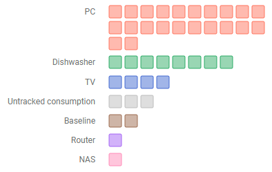
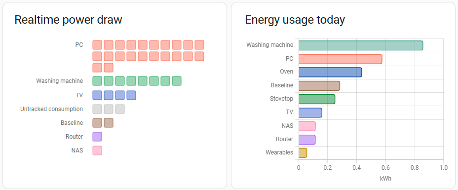

# Energy Devices Power Graph

Home Assistant dashboard card, displaying power usage per device, sorted by usage.
Entities are auto-configured from HA's existing energy configuration.



## State

Alpha, if that. Proof-of-concept, really.

## Concept / Intention

Home Assistant has a lot of facilities for tracking and displaying _energy_ use, i.e. the amount of electricity used by devices and/or your entire home over a certain amount of time, measured in `Wh`.

However, I was also interested in getting a real-time reading from my meters, to see which devices are drawing how much power in this very second. HA calls this _power_, measured in `W`. These are two fundamentally different concepts, and HA's Energy dashboard (appropriately) does not display any values from power meters, has no power graphs, etc.

It does not even have any facilities to manage power meters. While there is an Energy Configuration screen which allows you to set up a list of 'Individual devices', note that this only is a labelled list of energy meters. Energy meters in HA do not commonly reference their power meters (even if most smart plugs measure both) and there's currently no way in HA to maintain a list of 'Individual devices' power meters.

The purpose of this component is to provide such a power draw overview. Specifically, to be able to show (current) power draw and (over time) energy usage side-by-side.
If that's what you're looking for, then you should be aware that unfortunately, HA's `energy-devices-graph` [does not display untracked consumption](https://community.home-assistant.io/t/wth-does-the-individual-device-total-usage-misses-untracked-consumption/804340) (as of v2025.1).



I started out with a donut chart but quickly realized that purely relative charts are quite uninteresting for power usage. ("Okay, 50% of my mains power is currently used by the TV, but how much is that? Is it idle ...?")

So I ultimately settled on this dot matrix / waffle chart, because it reflects both the relative relationships as well as give an single-glance impression of how much power a device is drawing.

The component also displays what HA calls 'untracked consumption' on energy devices. Here it represents whatever power the grid meter measures that cannot be associated with any specific device.

The card currently updates on a configured time-based rhythm, by default every 10s. It specifically does *not* refresh when one
of the meters (mains or power consumer) changes. I'm not yet convinced that this is the best approach, but it does prevent flickering for now, and it's more predictable that way.

## Preconditions

An HA instance with a configured Energy setup. Specifically, you need a grid consumption energy sensor (Wh) and you should have energy sensors (Wh) for individual devices set up -- either real meters or virtual sensors using e.g. [Powercalc](https://docs.powercalc.nl/).

All of these sensors, for grid consumption as well as the device meters, should have corresponding power sensors (W).


## Installation

### Install via HACS

**1.** Open HACS from your Home Assistant sidebar

**2.** Add [this repository](https://github.com/hheimbuerger/lovelace-energy-devices-power-graph-card) as a custom repository (Three dots in top right corner -> Custom repositories)

**3.** Select "Lovelace" as the category

**4.** In HACS, search for `Energy Devices Power Graph`, select, click on the `Download` button in the bottom right, and confirm to `Download`

**5.** Confirm to reload your browser

**6.** Add the card to your dashboard. Even though there's no visual editor, I suggest adding it to the visual dashboard editor and using the quick preview while editing the YAML.

**7.** In the default configuration, it lists the energy-to-power-meter mappings for review and debugging below the chart. Edit the lookup rules until you're happy and ideally, all the red question marks are gone. Then remove the `debug` field from your configuration and save.

## Options

There is currently no card editor UI, the card must be configured via YAML.

| Name                             | Type                   | Requirement  | Description                                                                                                                                                     | Default             |
|----------------------------------|------------------------|--------------|-----------------------------------------------------------------------------------------------------------------------------------------------------------------|---------------------|
| `type`                           | string                 | **Required** | `custom:energy-devices-power-graph`                                                                                                                             |                     |
| `header`                         | string                 | **Optional** | HA card-internal headline                                                                                                                                       | (none)              |
| `includeUntracked`               | boolean                | **Optional** | Whether to include untracked consumption in the graph.                                                                                                          | `true`              |
| `squareSize`                     | number                 | **Optional** | Size of each square in the graph (in pixels).                                                                                                                   | `18`                |
| `squaresPerRow`                  | number                 | **Optional** | Number of squares per row in the graph.                                                                                                                         | `10`                |
| `width`                          | number                 | **Optional** | Width of the SVG element (in pixels).                                                                                                                           | `486`               |
| `minimalPowerDisplayed`          | number                 | **Optional** | Minimum power value to be displayed in the graph.                                                                                                               | `2`                 |
| `updateFrequency`                | number                 | **Optional** | Frequency of updates in seconds.                                                                                                                                | `10`                |
| `energyToPowerSensorLookups`     | list of `A -> B` strings     | **Optional** | Array of mappings from energy sensors to power sensors. These are text search & replace operations on the sensor names.                                                                                    | `- "_energy -> _power"]` |
| `debug`                          | string                 | **Optional** | Debug setting, can be 'true', 'false', or 'console-only'.                                                                                                       | `false`             |

## Example configuration

```yaml
type: custom:energy-devices-power-graph
header: "Power Usage"
energyToPowerSensorLookups:
    - "_total_energy -> _power_consumption"
    - "_accumulated_consumption -> _power"
    - "_energy -> _power"
width: 486
minimalPowerDisplayed: 2
includeUntracked: true
updateFrequency: 10
debug: 'true'
```

## Known Issues and Limitations / Roadmap

* The card should probably (optionally) show a legend, clarifying the block representation of a certain amount of Watts.
* It would be nice to (optionally) display the actual readings as numbers as well.
* There should be some kind of animation to transition from one display state to the next, to get some visual feedback on which devices' power draws are increasing or decreasing right now.
* Considering to optionally show the untracked power always as the very last item in the list.
* There needs to be better feedback if the corresponding power sensor of an energy sensor cannot be identified.

## Development

The vast majority of the code was written by GitHub Copilot (GPT-4o and Claude 3.5 Sonnet) via microphone in an interactive session.
